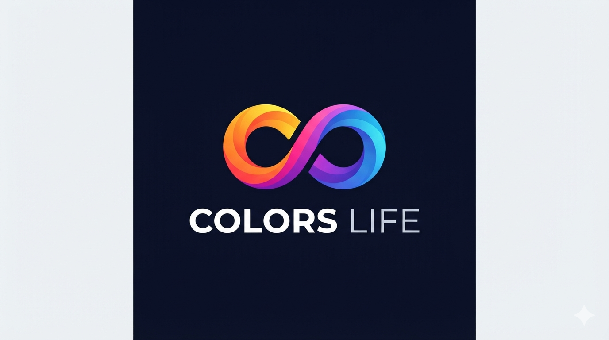
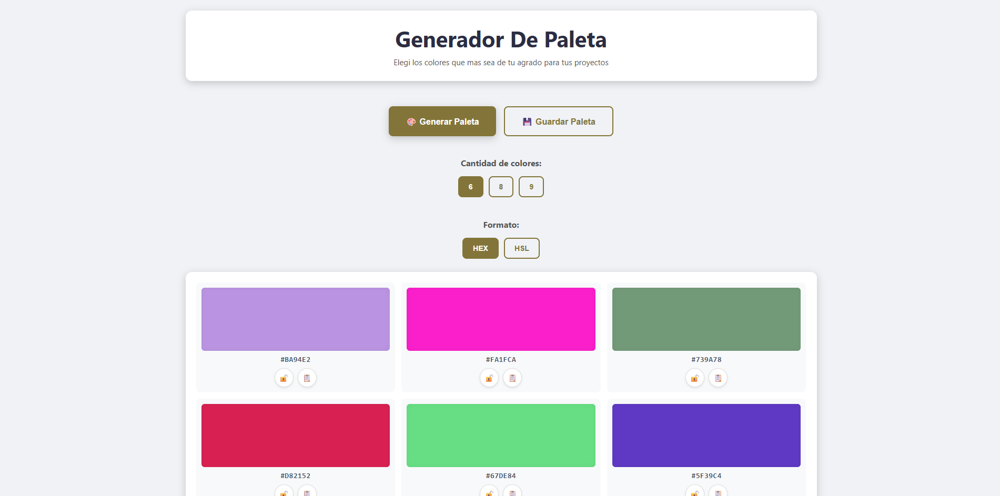
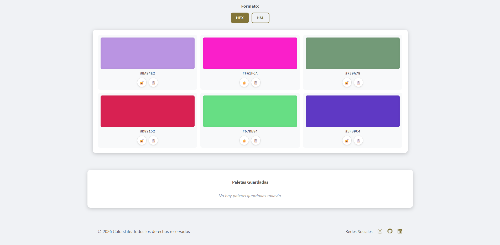

<div align="center">
  
</div>

# 🎨 Generador de Paleta de Colores

ColorsLife es una aplicación web interactiva desarrollada con arquitectura MVP, diseñada para generar paletas de colores aleatorias de forma rápida y práctica.

Este proyecto fue realizado con HTML, CSS y JavaScript puro, manipulación del DOM, eventos, algoritmos de conversión de color, almacenamiento local y buenas prácticas de desarrollo frontend.

**🔍 Enlace a la página web:** _[ColorsLife](https://yahiralmendras22.github.io/ProyectoM1_YahirAlmendras/)_

---

## 📸 Capturas de pantalla y GIF de uso

### Página Principal



### Final de la Página



### GIF de uso


---

## 🛠️ Herramientas Utilizadas

### Durante el desarrollo del proyecto se trabajó con:

- HTML5
- CSS3
- JavaScript (ES6+)
- LocalStorage API
- Git
- GitHub
- GitHub Pages
- Arrays y objetos
- JSON.stringify() y JSON.parse()
- Clipboard API
- Accesibilidad básica
- Eventos
- Funciones
- Manipulación del DOM

---

## 🚀 Características

- 🎨 Generación automática de paletas de colores aleatorias.
- 🔢 Selección de **6, 8 o 9 colores** por paleta.
- 🎯 Visualización de colores en formato **HEX** o **HSL**.
- 🔒 Bloqueo de colores para conservarlos al generar nuevas paletas.
- 📋 Copia del código de cualquier color al portapapeles.
- 💾 Guardado de paletas personalizadas con nombre.
- 📅 Registro de la fecha de creación de cada paleta guardada.
- 🗑️ Eliminación de paletas guardadas.
- 💽 Persistencia de datos mediante **LocalStorage**.
- 📱 Diseño responsive utilizando Flexbox y CSS Grid.

---

## 📂 Estructura del proyecto

ProyectoM1_YahirAlmendras/
│
├── index.html
├── styles.css
├── README.md
│
├── media/
│   └── generador-de-paleta.gif
│
├── assets/
│   ├── favicon.ico
│   ├── captura.png
│   ├── captura1.png
│   └── captura2.png
│
├── js/
│   └── script.js
│
└── documentacion/
    └── (capturas del proceso)
---

## ⚙️ Instalación

Clona este repositorio:

```bash
git clone https://github.com/yahiralmendras22/ProyectoM1_YahirAlmendras.git
```

Ingresa a la carpeta del proyecto:

```bash
cd ProyectoM1_YahirAlmendras
```

Abre el archivo **index.html** en tu navegador favorito.

---

## 📖 Cómo utilizar la aplicación

1. Haz clic en **🎨 Generar Paleta** para crear una nueva combinación de colores.
2. Selecciona la cantidad de colores que deseas visualizar (6, 8 o 9).
3. Cambia el formato de visualización entre **HEX** y **HSL**.
4. Bloquea los colores que quieras conservar usando el botón 🔒.
5. Copia cualquier código de color haciendo clic sobre su tarjeta.
6. Guarda la paleta asignándole un nombre personalizado.
7. Consulta, administra o elimina las paletas guardadas desde la sección **Paletas Guardadas**.

---

## 💡 Funcionalidades principales

### Generación de colores
Cada color se genera de manera dinámica utilizando valores hexadecimales aleatorios.

### Conversión de formato
Los códigos de color pueden alternarse entre los formatos **HEX** y **HSL** en tiempo real sin modificar los tonos actuales de la paleta.

### Bloqueo de colores
Permite fijar determinados tonos para que no cambien al presionar el botón de generación o al alterar la cantidad de tarjetas.

### Guardado de paletas
Las combinaciones se almacenan localmente en el navegador mediante la API de **LocalStorage**, guardando atributos como:
- Nombre personalizado
- Lista de códigos de color
- Persistencia entre sesiones de navegación

### Gestión de paletas
La sección inferior permite listar de forma dinámica las combinaciones creadas y eliminarlas mediante el botón de la papelera.

---

## 🤖 Uso de Inteligencia Artificial

Durante el desarrollo de este proyecto, se utilizaron herramientas de Inteligencia Artificial como soporte técnico (**ChatGPT**, **Claude** y **Gemini**). Su uso se centró en solicitar explicaciones detalladas sobre fórmulas y lógicas paso a paso para integrarlas bajo mi propia supervisión. Trabajamos codo a codo probando cada fragmento de código de manera rigurosa antes de incluirlo en el repositorio, lo cual optimizó mi curva de aprendizaje al estar iniciando en el mundo de la programación.

### ¿En qué utilicé la IA?:

- **Comprensión conceptual:** Flujo de funciones, delegación de eventos y renderizado dinámico en el DOM.
- **Lógica algorítmica:** Generación aleatoria de colores, conversión matemática de formatos (HEX a HSL y viceversa) y persistencia con la API de **LocalStorage**.
- **Interactividad del usuario:** Bloqueo selectivo de componentes gráficos y copiado de datos al portapapeles mediante la Clipboard API.
- **Estructura del diseño:** Maquetación adaptativa, inserción de iconos en el footer y configuración del archivo favicon.
- **Documentación técnica:** Guía en la redacción y formato del archivo de presentación del proyecto.

### ¿Qué cosas aprendí?:

Toda esta experiencia me sirvió para asimilar, estructurar y dominar conceptos complejos de JavaScript Vanilla, entendiendo la profundidad que requiere el desarrollo de software interactivo en el entorno frontend.

### 📂 Documentación del Proyecto

Puedes ver todas las capturas y detalles haciendo clic en el siguiente enlace:
👉 [Ver Carpeta de Documentación](./documentación)

---

## 🌐 Repositorio

GitHub:
**ProyectoM1_YahirAlmendras**

<https://github.com/yahiralmendras22/ProyectoM1_YahirAlmendras>

---

## 👨‍💻 Autor

**Yahir Almendras**

- GitHub: <https://github.com/yahiralmendras22>
- LinkedIn: <https://linkedin.com/in/yahir-almendras-606379423>

